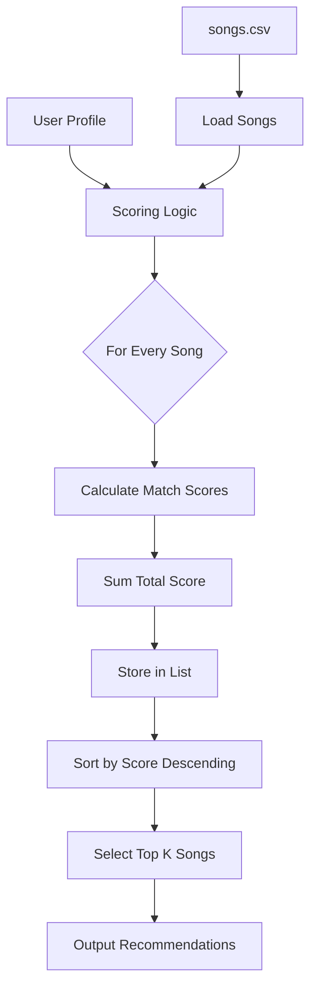
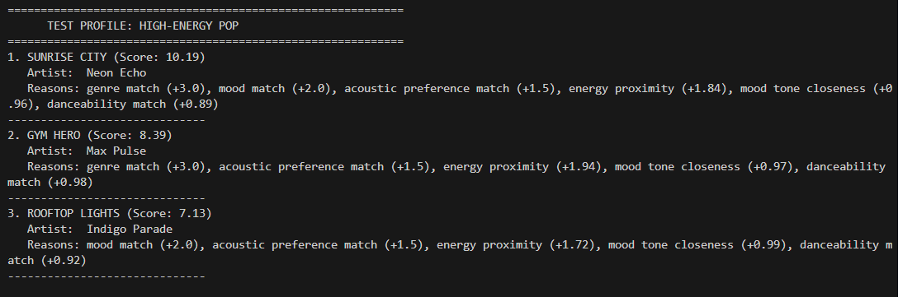
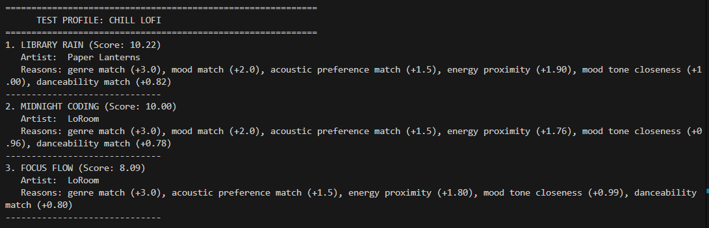
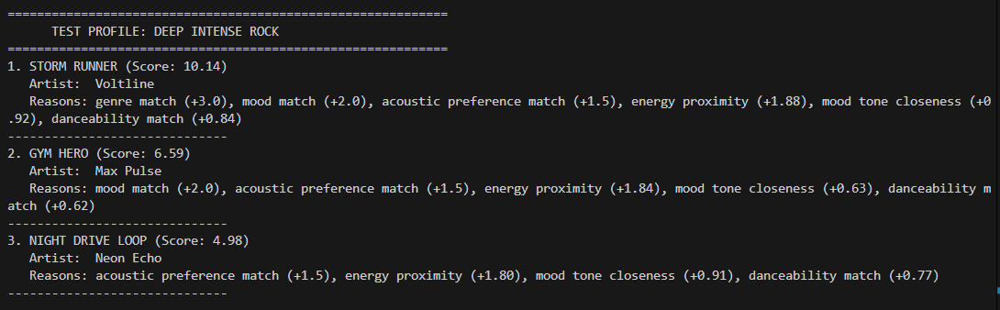
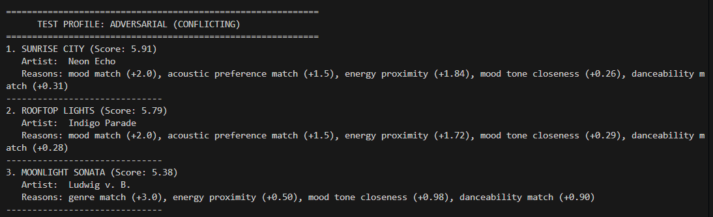
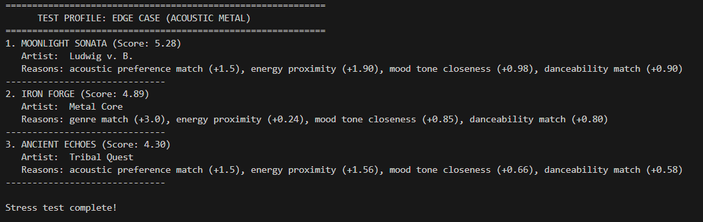

# 🎵 Music Recommender Simulation

This project implements **VibeTracker 1.0**, a content-based music recommender that uses transparent scoring to suggest songs. It analyzes a dataset of 18 diverse tracks, matching them against user profiles using a weighted "algorithm recipe" that considers genre, mood, energy, and acousticness. The system is designed to provide clear explanations for its decisions, helping users understand the logic behind their personalized recommendations.


---

## How The System Works

Real-world recommenders analyze massive behavioral datasets using collaborative filtering and deep learning to predict user intent. This simulation prioritizes content filtering, calculating relevance by matching song attributes directly against explicit user preferences.

**Simulation Features:**

- **Song:** genre, mood, energy, tempo_bpm, valence, danceability, acousticness.
- **UserProfile:** favorite_genre, favorite_mood, target_energy, likes_acoustic, target_valence, target_danceability.

**Algorithm Recipe (Scoring Rules):**

- **Genre Match (+3.0)**
- **Mood Match (+2.0)**
- **Acoustic Preference (+1.5)**
- **Energy Proximity (Up to +2.0)**
- **Valence/Danceability Proximity (Up to +1.0 each)**

**Bias Note:** By weighting genre most heavily (+3.0), the system may create a "filter bubble" that ignores high-quality mood or energy matches if they fall outside the user's primary genre.


**Logic:** Computes a composite score based on these weights to rank the top results.




---

## Getting Started

### Setup

1. Create a virtual environment (optional but recommended):

   ```bash
   python -m venv .venv
   source .venv/bin/activate      # Mac or Linux
   .venv\Scripts\activate         # Windows
   ```

2. Install dependencies

```bash
pip install -r requirements.txt
```

3. Run the app:

```bash
python -m src.main
```

### Running Tests

Run the starter tests with:

```bash
pytest
```

You can add more tests in `tests/test_recommender.py`.

---

## Experiments You Tried

Use this section to document the experiments you ran. For example:

- What happened when you changed the weight on genre from 2.0 to 0.5
- What happened when you added tempo or valence to the score
- How did your system behave for different types of users

---

## Limitations and Risks

Summarize some limitations of your recommender.

Examples:

- It only works on a tiny catalog
- It does not understand lyrics or language
- It might over favor one genre or mood

You will go deeper on this in your model card.

---

## Reflection

Check out the detailed reflection and the model card for more information on the system's performance and design.

- [**Model Card**](model_card.md)
- [**Reflection Report**](reflection.md)

---

## Screenshots

Below are the results from our stress test profiles:

### 1. High-Energy Pop


### 2. Chill Lofi


### 3. Deep Intense Rock


### 4. Adversarial (Conflicting)


### 5. Edge Case (Acoustic Metal)

